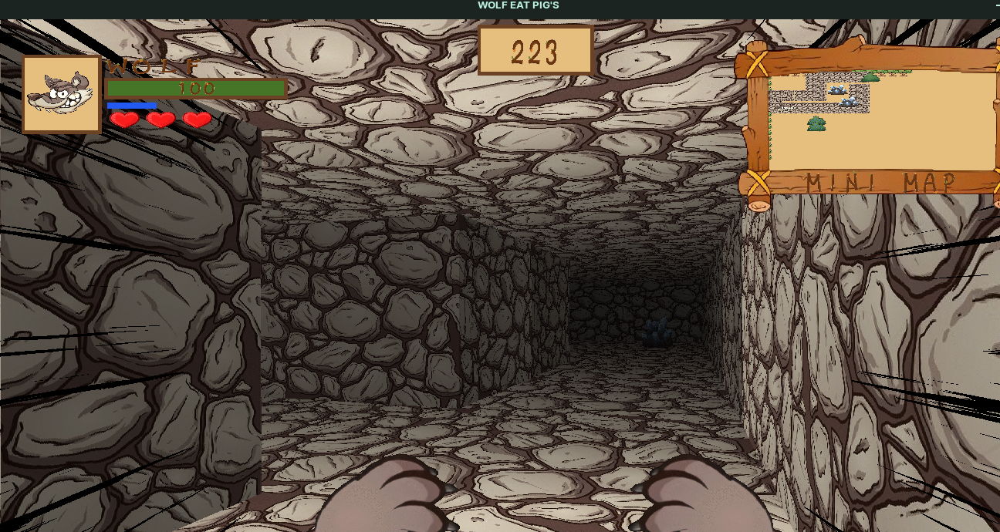

<h1 align="center"> Cub3d | 42 School Project </h1>
<h5>This project is inspired by the world-famous eponymous 90's game, which was the first FPS ever!</h5>
<p>It enabled me to explore ray-casting and the goal was to make a dynamic view inside a maze, in which you'll have to find your way.</p>


-----

<h4>What I learned with this project?</h4>
<p>Raycasting</p>
<p>Improved my understanding of window management</p>
<p>Improved my understanding of game development</p>
<p>Improved my understanding of memory management</p>

----

<h4>Subject</h4>
https://github.com/20AAP02/42_cub3d/blob/main/Subject.pdf
<br>
<h4>Grade : %</h4>
<h6>Mandatory : /100</h6>
<h6>Bonus : /25</h6>

----

<h4>How to use</h4>

```
git clone https://github.com/20AAP02/42_cub3d.git
cd 42_cub3d
make e
```

<i>Commands / keys</i>
```
Tab - Tasks  
W - Move Foward  
S - Move Backward  
A - Move to the Right  
D - Move to the Left  
N - Change weather/day time  
Arrows / Mouse - Change direction of player  
M - See Map  
Mouse right button - Blow wind  
Mouse left button - Atack / Collect Crystals  
E - Catch Fruits to get stamina  
SHIFT - Run  
```

----

<h4>Images</h4>

